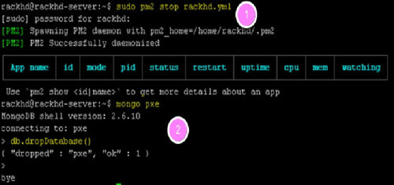
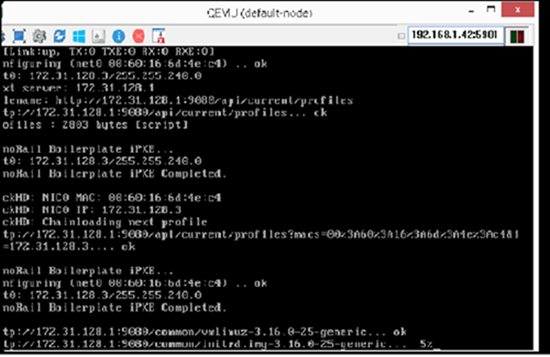
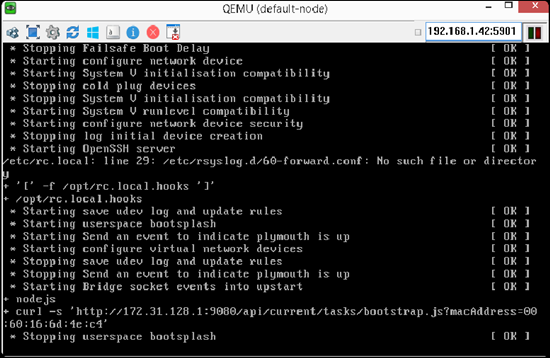

Dynamically Discovery and Catalog Server Nodes
===============================================

In this module, you will learn about RackHD's discovery, catalog and poller functionality by using
the simulated nodes that were set up in the previous modules.

- Discovery: RackHD can dynamically discover a node that attempts to PXE boot on the network that RackHD is monitoring.

- Catalog: RackHD can perform an inventory of the discovered nodes and capture the nodes' attributes and capabilities.

- Poller: RackHD can periodically capture nodes' telemetry data from the hardware interfaces.

Database cleanup overview
----------------------------------

When a node attempts to PXE boot on the network managed by RackHD, RackHD responds to
the PXE boot. If RackHD is not aware of the server, RackHD serves a microkernel image that
catalogs the node and records it with RackHD. If the node is already discovered (if a node's MAC
is recorded in RackHD's database), this node will not PXE boot the RackHD microkernel again.

The node will fail the PXE boot and move on to a hard disk boot.
In the previous modules, the sudo infrasim node start command already brought up the virtual
servers, and the virtual nodes are already discovered by RackHD. In this module, you will stop
RackHD and clean up the database so RackHD is forced to discover those nodes again.

Before the following operations are excuted, you need to ssh the vagrant box first. ``vagrant ssh dev`` can enter the demo environment. ``vagrant ssh dev_ansible`` can enter development environment.

Clean up the database
~~~~~~~~~~~~~~~~~~~~~

RackHD uses a Mongo database for storing static data such as catalog information or workflow states.

1. stop rackhd

For development environment,

.. code::
  
   sudo su
   pm2 stop /home/vagrant/rackhd-pm2-config.yml

For demo environment,

.. code::
  
    sudo service rackhd stop

2. Clean data base by typing the following command

.. code::
    
   mongo pxe

3. When the ">" prompt appears, type the following command

.. code::
 
   db.dropDatabase()

Press Ctrl+D to exit. Mongo will display 'bye', and then exit. The running process of the development environment is shown in the following graph.

Restart RackHD
~~~~~~~~~~~~~~

1. Start RackHD again by typing the following command.

For development environment,

.. code::
   
   sudo su
   pm2 start /home/vagrant/rackhd-pm2-config.yml

For demo environment,

.. code::
  
    sudo service start rackhd

2. edit ``/opt/monorail/config.json``, set 16 line `"authEnabled": true` to `"authEnabled": false`

3. Wait several seconds, and then type the following RackHD restful API to ensure RackHD is started and is running successfully.

.. code::

    curl localhost:8080/api/current/nodes

4. The following message appears when RackHD is booting and not ready. The process takes several seconds. You can retry after 10 seconds.

.. code::

  curl: (7) Failed to connect to localhost port 8080: Connection refused

5. When the API returns "[]"(no nodes discovered so far) RackHD software stacks are running successfully.

Discovery
------------------

1. set up a vnode

.. code::
  
  sudo vagrant up quanta_d51

2. On the Windows desktop, double-click the UltraVNC Viewer, and connect to <IP>:5901,to view the PXE progress to boot the microkernel

3. The vNode console pauses for 1 minute, to catalog the node data on this server. After the microkernel boot is completed, the vNode reboots. This reboot indicates that the discovery workflow is completed.

4.Retrieve the nodes by typing the following RackHD API to discover the node.

.. code::
  
    curl localhost:8080/api/current/nodes 

The output is in json format. If you append 'jq' to the end of the command it will format the output

.. code::
   
   curl localhost:8080/api/current/nodes | jq '.'

You can see one or more enclosure nodes ("type": "enclosure") and computer names ("type": "compute").

 
Node-ID
-----------------

Node-ID is the unique Identity of a node in RackHD.

1. On the Windows desktop, double-click the mRemoteNG tool to login to RackHD.
2. List all the compute type nodes being discovered on the rackhd-server SSH console by typing the following command. Append ?type=compute as a query string.

You will focus on compute type nodes in this module

.. code::

  curl 127.0.0.1:8080/api/current/nodes?type=compute | jq '.'

In the following json output, the compute node ID is ``58b660116d20657f0c5d6466``. You will demote it as a variable named <node_id> in the following module.

**Note**: The node_id varies for different nodes. Even for the same node, the Node ID changes if the RackHD database is being cleaned and the node rediscovered.

Do not use the example ``58b660116d20657f0c5d6466`` in your vLab. Use the displayed Node ID in your lab.

Retrieve catalogs
--------------------------

Catalogs are described as the following:

- Free form data structures with information about the nodes
- Pluggable mechanisms for adding new catalogers for additional data
- JSON documents stored in MongoDB

Examples of catalog sources include the following:

- DMI from dmidecode
- OHAI aggregate of different stats in more friendly JSON format
- IPMI typically ipmitool over KCS channel LAN information
- User information
- FRU, SEL, SDR, MC information
- lsscsi, lspci, lshw
- Vendor-specific AMI
- Storcli
- RACADM
- LLDP

**Specify the catalogs source**

1. To view the sources where the catalogs data was retrieved from, type the following command.

**Note**: the <node_id> is the Node-ID retrieved from Step 3.

.. code::
   
    curl 127.0.0.1:8080/api/current/nodes/<node_id>/catalogs/ | jq '.' | grep source

2. Select one of the sources you are interested in, and then append to the command. For example, the following example use ipmi-fru

.. code::

   curl 127.0.0.1:8080/api/current/nodes/<node_id>/catalogs/ipmi-fru | jq '.'

or "driveId" as example

.. code::

   curl 127.0.0.1:8080/api/current/nodes/<node_id>/catalogs/driveId | jq '.'

Retrieve Pollers
------------------------

What's Poller
~~~~~~~~~~~~~

- The "pollers" API provides functionality for periodic collection of status information from hardware devices (monitoring) IPMI, redfish and SNMP data. (SNMP data is available for vSwtich, which is not included in this vLab. while redfish pollers is neither included .)
- Regularly gather SNMP, IPMI primary mechanisms today
- Pollers capture from protocol, convert into events and provide live data stream via pub/sub

Examples of Telemetry
~~~~~~~~~~~~~~~~~~~~~

- Switches Switch CPU, Memory
- Port status
- Port utilization
- Arbitrary MIB gathering capable
- PDU Socket status
- Arbitrary MIB gathering capable
- IPMI Sensors (SDR)
- Power status

Set the OBM Setting
~~~~~~~~~~~~~~~~~~~~

Before you set up the poller, you must set the OBM Setting. Out-of-Band-Management (OBM) typically refers to the BMC interface on the server.

To talk with BMC, RackHD must be configured with the the BMC IP and credentials. You must bind them with a <node_id>, so that IPMI communication between the node and RackHD can be established. In RackHD refers to this as the OBM Setting.

1. For a <node_id>, retrieve the BMC IP address, from the catalogs among "bmc" source, by running the following command on rackhd-server.

.. code::

**Note**: the <node_id> is the Node-ID retrieved from Step 3.

.. code::
 
   curl localhost:8080/api/current/nodes/<node_id>/catalogs/bmc | jq '.' | grep "IP Address"

2. In the following example, the BMC IP is 172.31.128.23. and it will be the value of <BMC_IP> variable in next step.

.. code::

3. Include the BMC IP (it should be 172.31.128.xx , the DHCP from rackhd-server) in the following command, to set an IPMI OBM setting on a node.

**Note**: Do not forget to fill the exact <BMC_IP> and <node_id> based on those assigned to your specific nodes.

.. code::

 curl -X PUT -H 'Content-Type: application/json' -d ' { "service": "ipmi-obm-service", "config": { "host": "<BMC-IP>", "user": "admin", "password": "admin" } }' 127.0.0.1:8080/api/current/nodes/<node_id>/obm

4. Once the OBM credentials have been configured, RackHD can communicate with BMC in workflows (e.g. power-cycle the BMC or retrieve poller data)

Retrieve Pollers
~~~~~~~~~~~~~~~~~

1. On rackhd-server,list the active pollers which by default run in the background, by typing the following command.

.. code::

  curl 127.0.0.1:8080/api/current/pollers| jq '.'

Below is a definition of each field in the example output below:

- "id" is the poller's id. Denote it as <poller_id>. you will refer to later.
- "type" means it is an IPMI poller or SNMP poller, and so on.
- "pollInternal" is the interval for the frequency that RackHD polls that data. The time is the milliseconds to wait between polls.
- "node" is the target node of the poller that the data comes from.
- "command" is the kind of IPMI command that this poller is issued.

Note: Record listed below is an example. The output on your screen will look similar with different
data.

.. code::

 {
  "id": "58b66105a36ced790cd01091",
  "type": "ipmi",
  "pollInterval": 30000,
  "node": "/api/2.0/nodes/58b660116d20657f0c5d6466",
  "config": {
  "command": "sdr"
  },
  "lastStarted": "2017-03-01T06:22:35.417Z",
  "lastFinished": "2017-03-01T06:22:55.241Z",
  "paused": false,
  "failureCount": 0
 }

2. Show the poller data, by typing the following command.

.. code::
 
  curl 127.0.0.1:8080/api/current/pollers/<poller_id>/data | jq '.' 

3. Change the interval of a poller, by typing the following command.

.. code::

 curl -X PATCH -H 'Content-Type: application/json' -d '{"pollInterval":15000}' 127.0.0.1:8080/api/current/pollers/<poller_id> HOL

.. image:: ../_static/pollers_info.png
     :height: 350
     :align: center

