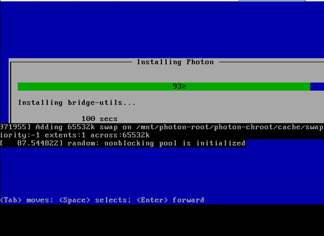

Perform an Unattended OS Install
=================================

Summary
------------

In this lab, you will leverage RackHD to perform an unattended OS install onto a bare metal server.

In this lab, the Photon OS is used as the example. It is a minimal Linux container host, optimized to run on VMware platforms. Photon was chosen because it is small enough for the OS installation to take approximately 8 or 9 minutes. The same process that is used in this lab can be used to install other mainstream operating systems, such as Ubuntu, CentOS, and ESXi, which take longer to install.

Install OS
-----------------

**Step 1. Prerequisite**

1. The quanta_d51 vnode which runs in vagrant is used as the OS-Install target node in this Lab. It's preferred that during the OS installation, to guarantee the performance -- Stop other vnodes during the OS installation . Run "sudo vagrant stop <vnode-name>" to stop other vnodes.

2. Get the information of vnode.

.. code::

  curl http://localhost:9090/api/current/catalogs | jq '.' | grep D51 -B8 | grep node

   
    
3. Use the mouse to select and copy ``node-id`` text( as shown in the below example snapshot). This ID will be used in the following steps.

4. In RackHD server, ensure its OBM setting is not blank. right click to paste the ``node-id`` text in the following command.

.. code::

  curl 127.0.0.1:9090/api/current/nodes/<node-id>/obm

In the following example, in the green block, the OBM is configured with the user name of admin.

If the response comes back as [ ], complete the Set the OBM Setting section in 7.2, to set the OBM setting.

5. **Notes**: [Why only "quanta_d51" ]: There were some known issues(kernel panic) about installing PhotonOS on non-Quanta vNode, for RackHD 1.3.x version. So that's why the second step ensures the type is Quanta_D51.

**Step 2. Set Up OS Mirror**

To provision the OS to the node, RackHD can act as an OS mirror repository.

1. enter vagrant box.

.. code::
  
    sudo vagrant ssh dev           # for demo environment
    sudo vagrant ssh dev_ansible   # for development environment

2. Create the following folders
  
.. code::

    sudo su
    cd ~/iso
    mkdir -p /var/mirrors/Photon
    mkdir -p ~/node_modules/on-http/static/http/mirrors/
   
3. Create OS mirror from an ISO image by typing below command. (Note: The photon-1.0-13c08b6.iso is already downloaded in ~/iso)

.. code::

   sudo mount -o loop photon-1.0-13c08b6.iso /var/mirrors/Photon

[when prompted , type rackhd as ``password``]

4. Set up a Photon OS install mirror under/var/mirrors/Photon.

.. code::

   sudo ln -s /var/mirrors/Photon ~/node_modules/on-http/static/http/mirrors/

When prompted, type **rackhd** as the password.

5.The OS mirror will be available on ``http://<IP>:9092/mirrors/Photon`` from vNode's perspective.

 
**Step 3. Install OS with RackHD API**

In this step, you will create a payload file, and then leverage the RackHD build-in workflow to install and OS on the vNode.

**Download the Photon payload template**

1. Download the Photon OS install payload example by running the following command. For more payload examples, see example of other OS.

.. code::

   cd ~/iso
   wget https://raw.githubusercontent.com/RackHD/RackHD/master/example/samples/install_photon_os_payload_minimal.json

**Modify payload file**

2. Modify the payload json file by using vim.

(2.1) Open file with vim, by typing the following command.

.. code::

  vim install_photon_os_payload_minimal.json

(2.2) To edit the file using vim, press the i key to enter editing mode. While in editing mode, the vim console displays -- **INSERT** -- in the bottom left.

(2.3) Change the "repo" line to below then save .

.. code::

  "repo": "http://172.31.128.1:9092/mirrors/Photon"

(2.4) Save and exist vim ( Hit "ESC" key first, then type ":wq" , then hit "Enter")

**Send the workflow**

Install the OS by using build-in "InstallPhotonOS" workflow and the ``<node-ID>`` that you obtained in the Prerequisites at the beginning of this lab. Run the following command

.. code::

  curl -X POST -H 'Content-Type: application/json' -d @install_photon_os_payload_minimal.json 127.0.0.1:9090/api/current/nodes/<node-ID>/workflows?name=Graph.InstallPhotonOS | jq '.'

**Step 4. Progress**

1. Run the following API to monitor a workflow that is running.

.. code::

  curl 127.0.0.1:9090/api/current/nodes/<Node_ID>/workflows?active=true | jq '.'

In the json output RackHD responses, you will see "_status" field is "running", and "graphName" field is "Install Photon OS",

`Note: If the "[]" is quickly returned, the workflow failed immediately. The failure is likely because the OBM setting is not set. (No OBM service assigned to this node.)`

2. Use UltraVNC to monitor the corresponding vNode's console.

3. It will PXE boot from the Photon OS install image, then after 5 mins, it will show blue progress screen as below. The entire Photon OS installation will take ~9 mins.

You can move on the guide or revisit previous sessions, then go back after 4~5 minutes .

