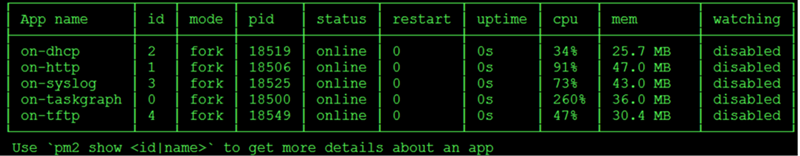
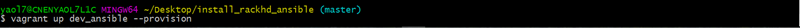
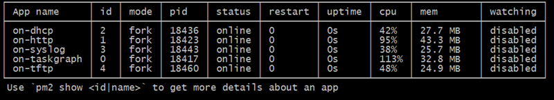

RackHD: local Vagrant based setup
==================================

This tutorial gets an instance of RackHD up and running on your local desktop or
laptop, so you can see the hosted API documentation and experiment with the APIs.

prerequisites
--------------

.. sidebar:: jq

    You can get details on how to use `jq`_ at https://stedolan.github.io/jq/manual/.
    By default it colorizes the syntax highlighting and pretty prints javascript data structures.

    Another option that can provide the same pretty printing is use::

        | python -m json.tool

    which can also be used with a pager, such as `less`.

You will need to have `Vagrant`_ (>=1.8.1) and `VirtualBox`_ (4.3.x) installed on your machine to use
this tutorial.

You may also want to consider installing `jq`_ which provides a command-line
oriented tool for pretty printing and filtering JSON structured data.

.. _Vagrant: https://www.vagrantup.com/downloads.html
.. _Virtualbox: https://www.virtualbox.org/wiki/Downloads
.. _jq: https://stedolan.github.io/jq/

.. container:: clearer

   .. image :: ../_static/invisible.png

what we're setting up
----------------------

.. sidebar:: VirtualBox

    In some high-load cases, you may run into some issues with VirtualBox where it
    locks the fileystem, with the console returning the error message:
    ``rejecting i/o input from offline devices``.

    This is a known issue with VirtualBox, documented in Puppet's `LearningVM bug tracker`_
    and with some additional detail on the `timekeeping`_ that's related.

    The workaround suggested there that seems to resolve the issue is to set Virtualbox CPUs to 1
    and disable the I/O APIC feature when running the virtual machine.

.. _LearningVM bug tracker: https://www.kernel.org/doc/Documentation/virtual/kvm/timekeeping.txt
.. _timekeeping: https://www.kernel.org/doc/Documentation/virtual/kvm/timekeeping.txt

.. image:: ../_static/vagrant_setup.jpg
     :height: 300
     :align: left

The Vagrant instance sets up a pre-installed RackHD VM that connects to one or more VMs
that represent managed systems. The target systems are simulated using PXE clients.

The RackHD VM has two network interfaces. One connects to the local machine via NAT (Network Address Translation)
and the second connects to the PXE VMs in a private network. The private network is used so that RackHD DHCP and
PXE operations are isolated from your local network.

The Vagrant setup also enables port forwarding that allows your localhost to access the RackHD instance:

- localhost:9090 redirects to rackhd:8080 for access to the REST API
- localhost:2222 redirects to rackhd:22 for SSH access
- localhost:9093 redirects to rackhd:8443 for secure access to the REST API

Set up RackHD in Vagrant on Linux
-----------------------------------
There are two kinds of vagrant-based environment. One is used for demo and another is used for developing. How to set up these environments is shown as follows.

.. container:: clearer

   .. image :: ../_static/invisible.png

1. Demo environment set up

- Clone the RackHD repository

.. code::

    git clone https://github.com/rackhd/rackhd
    cd rackhd/example

- Edit the Vagrantfile 
  
  delete the line 89: 'v.gui = true'

  add ``target.vm.box_version = "2.2.0"`` in line 12.

[**Node**] version must be 2.* and the version can be searched in https://app.vagrantup.com/rackhd/boxes/rackhd
 
  

- Set up a RackHD vagrant instance

.. code::

    vagrant up dev --provision

- check whether RackHD is set up successfully.

.. code::
   
     vagrant ssh dev
     sudo service rackhd status

If RackHD is set up successfully, the result will be shown as follows.

2. Development environment set up

- Clone the RackHD repository

.. code::

    git clone https://github.com/yaolingling/install_rackhd_ansible
    
- Set up a RackHD vagrant instance

.. code::
    
    cd install_rackhd_ansible
    vagrant up dev_ansible --provision

- check whether RackHD is set up successfully.

If the RackHD is setup successfully, the result will be shown as follows.

[**Note**] If you want to pull special source code of RackHD, you can edit the line 8 ``code_version: "release/2.1.0"`` of the file **install_rackhd_vagrant.yml**

The logs from RackHD will show in the console window where you invoked this last
command. You can use control-c (^C) to stop the processes. Additionally you can
SSH into the local instance using the command ``vagrant ssh dev`` and destroy
this instance with ``vagrant destroy dev``. For more information on Vagrant,
please see the `Vagrant CLI documentation`_.

.. _Vagrant CLI documentation: https://www.vagrantup.com/docs/cli/

Set up RackHD in vagrant on windows
-----------------------------------

Prerequisite
~~~~~~~~~~~~

- Ensure your machine has more than 8G physical memory, because RackHD & vNode will use 4G mem. there will be performance impact without enough physical memory.

- Don’t use virtualbox GUI to power on/off/reset the vNode ( quanta_d51). Use vagrant command with “--provision” parameter  (vagrant halt -f quanta_d51 ,      vagrant up quanta_d51 --provision  )

Steps to set up
~~~~~~~~~~~~~~~

There are two kinds of environments for RackHD running in vagrant. One is used for demo and another is used for development. Steps to set up RackHD for the two kinds environment is similar.

**step 1: Install vagrant & virtualbox on windows**

- https://www.virtualbox.org/wiki/Downloads

- https://www.vagrantup.com/downloads.html

**step 2: Create a Vagrantfile (case sensitive ) in Windows**

If you want to set up demo environment, get code from: https://github.com/RackHD/RackHD/blob/master/example/Vagrantfile. However, you need to edit the code - delete the 89 line:`v.gui=true` 
 
If you want to set up development environment, get code from: https://github.com/yaolingling/install_rackhd_ansible

**step 3:  Right mouse click the folder where Vagrantfile lives, to launch “git bash here”**

.. image:: ../_static/git_bash_here.png
     :height: 450
     :align: center

**step 4:  In “Git Bash”**

1. Type “vagrant up <vm name>”, to start RackHD VM. Take development environment for example:

2. Then, start installing RackHD in vagrant.Take development environemnt for example, the result will be shown as follows if RackHD is setup successfully.

