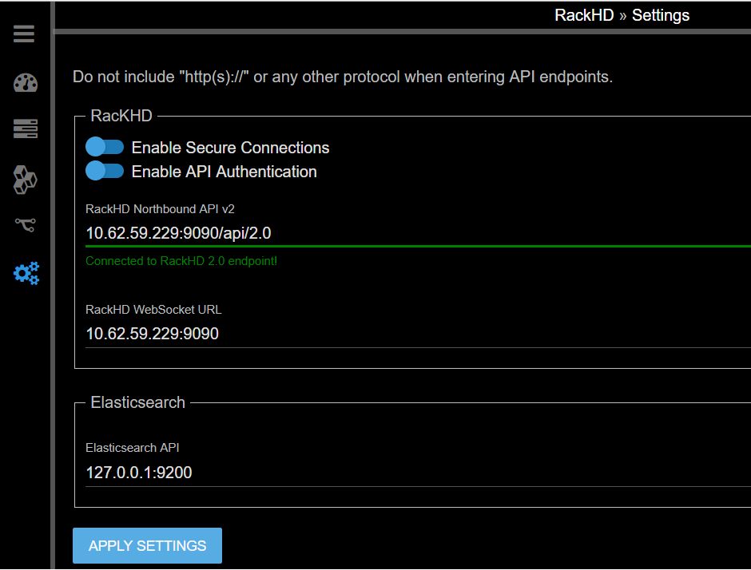

Workflow Editor
================

Before the following operations are excuted, you need to ssh the vagrant box first. ``vagrant ssh dev`` can enter the demo environment. ``vagrant ssh dev_ansible`` can enter development environment.

Step 1: Download on-web-ui
---------------------------

For development environment,

.. code::

  mkdir -p /home/vagrant/src/on-http/static/http
  cd /home/vagrant/src/on-http/static/http/
  wget https://github.com/RackHD/on-web-ui/archive/gh-pages.zip
  unzip gh-pages.zip
  mv on-web-ui-gh-pages on-web-ui
  cd ~

For demo environment,

.. code::

  mkdir -p /var/renasar/on-http/static/http
  cd /var/renasar/on-http/static/http
  wget https://github.com/RackHD/on-web-ui/archive/gh-pages.zip
  unzip gh-pages.zip
  mv on-web-ui-gh-pages on-web-ui
  cd ~

Step 2: Configure on-web-ui
----------------------------

1. On the Windows desktop of launchpad, open Chrome, and then and go to the following URL. ``http://<IP>:9090/on-web-ui``

2. click the "gear" button on the left panel

3. leave the 2 switches as default ( in this Lab, in the /opt/monorail/config.json, the https and api authentication are both disabled )

4. On the Windows desktop of launchpad, fill the API 2.0 end point (<IP>:9090/api/2.0)

5. On the Windows desktop of launchpad, fill the API 1.1 end point (<IP>:9090/api/1.1)

6. click "apply settings" button on the bottom.

Step 3: Try on-web-ui
-----------------------

1. Click the meter button in the left panel.
2. You can view the nodes list in the table.
3. You can view the workflow history in the table.

4. Click a compute node in the Node List.

5. In the right panel, you can view the different APIs that are available, such as pollers, catalogs, and so on.

6. Experiment with the catalog of a node by clicking the "Catalogs" button.

7. Try one of the catalogs link shown in the available catalogs list. Example: click "SMART" to show the Disks S.M.A.R.T information captured on the node.

8. Click the "Operations Center" icon on the left panel

9. You can view the workflow history and the current running workflow status.

10. Click one the the workflow (example: "Discovery") to view the workflow diagram and status.

Step 4: Create a new workflow
-----------------------------

In this session, you will customize a RackHD workflow to implement your own logic.

**Workflow scenario**

You have a number of new bare metal servers coming online.

- Before the OS and applications are deployed to the new servers, you want to run a quick sanity check (diagnostic) on the servers.

- Due to a special demand of your application, you want to include a temperature check and CPU frequency check in the diagnostic step.

To fulfill the demand of scenario, you can use On-Web-UI to customize a new workflow named My_Workflow.

This example is a simple one. However, your customized workflows can be as complex as needed.

**"Workflow" in RackHD**

A workflow in RackHD is a JSON document, which describes a flow of execution and is built as a graph. A graph is composed by several tasks.

The tasks can be executed in serial or in parallel. Each task has a conditional output that can be used to drive the workflow down different paths based on how the task is completed (for example, Error, Failed, Succeeded).

Add a new workflow
~~~~~~~~~~~~~~~~~~

1. Click the Workflow Editor button on the left panel.
2. Type your workflow name (My_Workflow)
3. Press Enter on your keyboard. Do not use the Save button on the right.

4. On the pop up Confirm diagram, click "SUBMIT"

The Web-UI refreshes itself.

5. Click the Workflow Editor button on the left panel.

6. Type My_Workflow on the name box. The name is auto-populated. You can select the workflow you created.

The on-web-ui will show there's a dummy operation (no-op) in this workflow.

7. Use your mouse wheel to zoom in and zoom out on the view.

8. Drag and drop from left to right to move the view point.

9. On the right side, above the panel that displays the workflow source code, in the Task field, type **Set Node Pxeboot**, to select an existing task.

10. Click the + button, to add the task to your customized workflow.

11. Then a piece of workflow source code(json) will be appended into your workflow code .

12. On the left view, a new "task box" appeared, it will be named as "new-task-xxxxxx" (xxxxxx is randomly generated)

13. To make the name more readable, please change the label name from "new-task-xxxxxx" to **"set-boot-pxe"** (by clicking the string on the box then you can edit it.)

14. As below example, the newly added box has been renamed to **set-boot-pxe**.

15. Select the existing task Reboot Node.

16. Click the + button. The new task is added to the source code and a new task box is added to the visual editor.

17. Change the box name from random generated string to reboot.

``[Note]`` Besides, you need to edit the code block of **Reboot**, as is shown in the picture above.  

18. Select the existing task Boostrap Ubuntu

19. Click the + button.

20. Change the newly added box name to boostrap-ubuntu

customize a Shell Command Task
~~~~~~~~~~~~~~~~~~~~~~~~~~~~~~~

1. In the Task field, type Shell commands, to add a task.

2. Click the + button.

3. Change the new task's name to Diagnostic by clicking the name on the box.

4. In the workflow editor window on the right hand side, you can see three default shell commands for the Diagnostic task that you created.

The following example shows the default, automatically generated, json output.

.. code::

  "commands": [
   {
     "command": "sudo ls /var",
     "catalog": {
     "format": "raw",
     "source": "ls var"
     }
   },
   {
     "command": "sudo lshw -json",
     "catalog": {
     "format": "json",
     "source": "lshw user"
     }
   },
   {
     "command": "test",
     "acceptedResponseCodes": [ 1 ]
   }
  ]

5. Update the "commands" line. You can edit the json content inside the visual workflow editor sub-window. 

**Note**: Wait for approximately 5 seconds for the cursor to stop blinking, to indicate that the Web UI accepted your changes and passed the syntax check. Otherwise, the Web UI rejects your changes and restores the code back to the original code automatically. If the json format is invalid, Web UI restores the code back the original code.

6. Update the "commands" json block by adding the following commands

.. code::

   "commands": [
   {
     "command": "sudo lshw -json",
     "catalog": {
     "format": "json",
     "source": "customized-lshw"
     }
   },
   {
     "command": "temp=$( sudo ipmitool sdr|grep Temp|head -n1| awk '{print $3}' ) && echo Temperature: $temp && if [ $temp -gt 30 ]; then echo [Error] Over Temperature! $temp; exit -1; fi", 
     "catalog": {
     "format": "raw",
     "source": "customized-temp"
     }
  },
  {
    "command": "CPU_HZ=$(cat /proc/cpuinfo | grep MHz | head -n1 | awk '{print $4}') && echo CPU frequency : $CPU_HZ && if [ $(awk 'BEGIN{ print $CPU_HZ <2000 }') -eq 1 ]; then echo [Error] Wrong SKU. CPU frequency is too low: $CPU_HZ; exit -1; fi",
    "catalog": {
    "format": "raw",
    "source": "customized-CPU"
    }
  } 
 ]

**Explanation of the above 3 shell command tasks (optional step)**

You can skip this optional step.

Below it will explain the shell commands' meaning in last step.

[1] it will list the hardware by "lshw" and catalogs the output ( you can find the output from catalog after workflow completion.)

.. code::

  "command" : "sudo ls /var",
  "catalog" : {
    "format" : "raw",
    "source" : "ls var"
  }

[2] as below:This is a diagnostic sample for temperature. It's comparing the hardware's Ambient temperature with a threshold value (20 as an example) and fail this job if hotter than that.

.. code::
   
   temp=$( sudo ipmitool sdr|grep Temp|head -n1| awk '{print $3}' ) && \ 
   echo Temperature: $temp && \
   if [ $temp > 20 ]; then \
      echo [Error] Over Temperature! $temp; \
      exit -1; \
   fi

[3] It is comparing the hardware's CPU frequency with a threshold value (2500 as an example) and fail this job if lower than that.

.. code::

   CPU_HZ=$(cat /proc/cpuinfo | grep MHz | head -n1 | awk '{print $4}') && \
   echo CPU frequency : $CPU_HZ && \
   if [ $(awk 'BEGIN{ print $CPU_HZ <2000 }') -eq 1 ]; then \
      echo [Error] Wrong SKU. CPU frequency is too low: $CPU_HZ; \
      exit -1; \
   fi

Set the task relationship
~~~~~~~~~~~~~~~~~~~~~~~~~~~

Tasks display indicators that you can connect to set the task relationship. Each task displays a trigger indicator in the top left.

Each task also displays the following condition indicators on the right side:

- Red: when fail
- Green: when success
- Blue: when finish

For example, when you connect the green condition indicator of task A to the trigger indicator for Task B: when task A has succeeded, then task B is triggered.

1. Connect the green condition indicator of the set-boot-pxe task to the trigger indicator of the reboot task: whether the set-boot-pxe task is successful or not, the reboot task is triggered

2. Connect the green condition indicator of the reboot task to the trigger indicator of the bootstrap-ubuntu task.

When the reboot task is successfully completed, the bootstrap-ubuntu task is started.

Note: Use your mouse wheel to zoom in and zoom out on the view. Drag and drop from left to right to move the view point.

3. Click x to remove the no-op task.

4. Connect the green condition indicator for the reboot task to the trigger indicator for the Diagnostic task.

5. View your new workflow.

Save the workflow
~~~~~~~~~~~~~~~~~

1. Click the save icon to save the workflow

.. image:: ../_static/workflow_op23.png
     :height: 100
     :align: center

Step 5: Run the new workflow
----------------------------

Click the run icon, to run the workflow that you created in 7.5.4. 

On the pop up diagram,

1. Select a node (Note: choose a compute node identified with a MAC address, instead of an Enclosure Node.)

2. Click **SAVE** to run this workflow

3. On the desktop, double-click the UltraVNC Viewer tool, to check the bootstrap progress of the node you sent this workflow to.

4. Click the Operations Center tab. You can see that My_Workflow" is running. The target node ID is under the workflow name.

5. Click the running My_Workflow, to view the progress. After several minutes, the workflow is completed, and the color of the workflow indicates the running result (red for fail, yellow for canceled, green for success).

